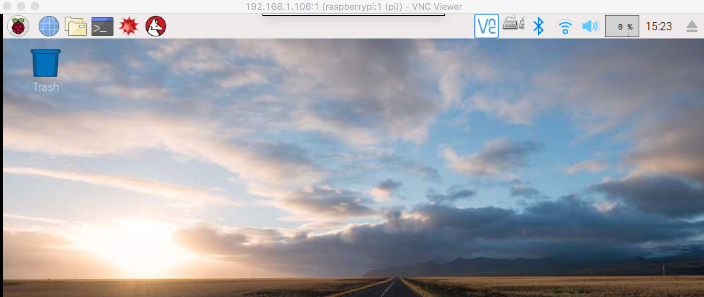

## 树莓派入门配置
### 1. 硬件
今天拿到了树莓派3B+的板子,

另外买了一张32G内存卡和一个读卡器，其他配件暂时没买，电源用的是一个带USB口的公牛插座，

至于电源线就用了一根普通的手机充电线，烧完系统之后接通电源，正常跑起来了。后续再考虑买一些配件玩玩。
### 2. 基本配置
一些基本配置网上教程很多，包括换源、键盘布局、时区设置、中文输入法安装、SSH、VNC等待，这里我主要记录一下自己配置过程中遇到的一些问题。 
* 修改pi用户密码
默认pi密码为raspberry，感觉太长了不方便，想改成和用户名一样，尝试`passwd`修改密码时，如果将密码设置为`pi`会提示密码太短，不让设置，这时只需要用root权限修改，即可修改成功。
`sudo passwd pi`，再次验证了没有root做不了的操作。到这里我顺便开启了root用户。
* ssh免密码连接
设置过程还比较顺利，之前已经生成过rsa密钥，直接把`id_rsa.pub`里面的内容写到Pi的`.ssh/authorized_keys`里面即可。
* vnc连接
目前最新的系统，Pi使用的vnc已经是realvnc了，看到有些教程使用的是tightvncserver，与realvnc冲突，在这里折腾了一段时间。Pi上启动vnc服务也很简单，执行`vncserver`即可。另外看到网上有教程是开机启动vnc服务的，我这里没有去研究，对我来说暂时还可以接受使用时输入一行命令启动。服务端安装好了，再就是客户端了。由于我使用的是MAC，不想额外安装vnc client，想用自带的vnc功能访问，发现无法连接，因此还是需要下载vnc客户端。另外我家的网络无法访问realvnc官网，所以网上搜了一个，安装之后连接成功。

***
上手第一天，记录一下。2018年06月10日15:25:49