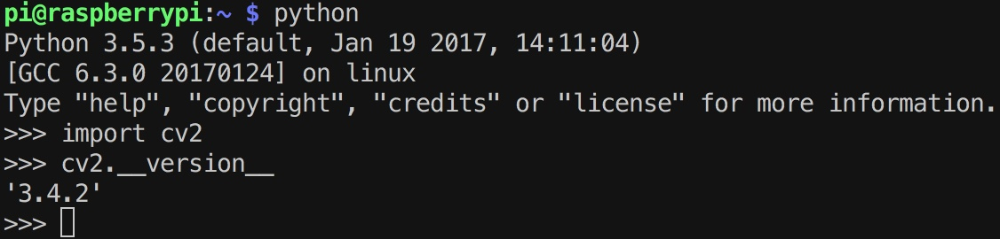

## 树莓派安装opencv 3.4.2版本（Python3）
1. Opencv下载
- 官网下载源码
2. 源码编译
```shell
unzip opencv-3.4.2.zip
cd opencv-3.4.2
mkdir build
cd build
```
```shell
cmake -D CMAKE_BUILD_TYPE=Release -D 
CMAKE_INSTALL_PREFIX=/usr/local 
PYTHON3_EXECUTABLE=/usr/bin/python3 
PYTHON_INCLUDE_DIR=/usr/include/python3.5 
PYTHON_LIBRARY=/usr/lib/arm-linux-gnueabihf/libpython3.5m.so PYTHON3_NUMPY_INCLUDE_DIRS=/usr/lib/python3/dist-packages/numpy/core/include ..
```
```shell
make  # 经过漫长的编译，耗时较长
sudo make install
```
额外收获知识点：
`make`的过程中，由于耗时较长，想将当前进程放到后台运行，让树莓派慢慢编译。
- `CTRL + Z`终端当前任务
- `bg`把被中断的任务放在后台执行
安心睡觉，让树莓派慢慢编译吧。第二天一早起来，执行`sudo make install`安装完成。


*******
#### 利用flask通过opencv读取树莓派摄像头
[资料参考](https://www.cnblogs.com/arkenstone/p/7159615.html)
multipart视频流的结构如下：
```
HTTP/1.1 200 OK
Content-Type: multipart/x-mixed-replace; boundary=frame

--frame
Content-Type: image/jpeg

<jpeg data here>
--frame
Content-Type: image/jpeg

<jpeg data here>
...
```


